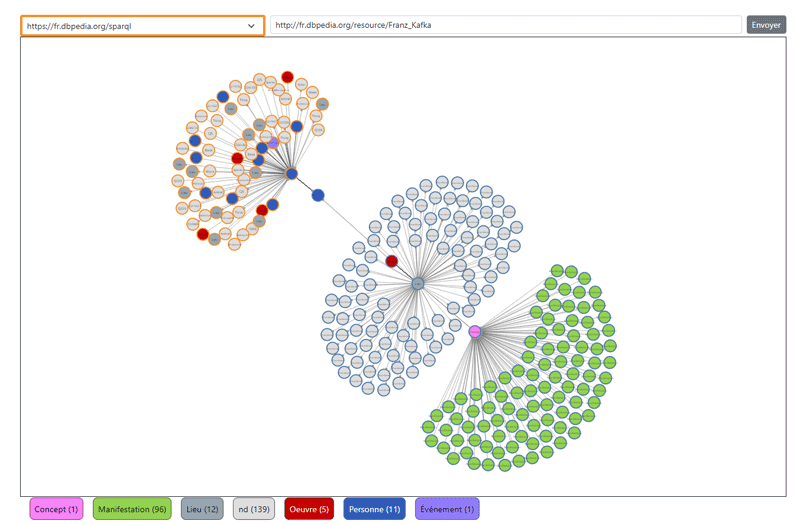

# GraphBib
GraphBib permet de visualiser des données issues du web de données sous forme de graphe et de mettre en évidence les alignements possibles.  
Les requêtes dont faites sur des points de terminaison SPARQL (data.bnf, dbpedia et Europeana).  
Le typage des entités est en adéquation avec l'ontologie IFLA-LRM.

  
  Renseigner un point de terminaison dans le menu déroulant et un URI dans le champ prévu à cet effet.  
  Cliquer sur le bouton *Envoyer* pour lancer la requête.  
  Double-cliquer sur un noeud du graphe pour le mettre à jour à partir de l'entité concernée.  
  Contrôler le zoom avec la molette de la souris.